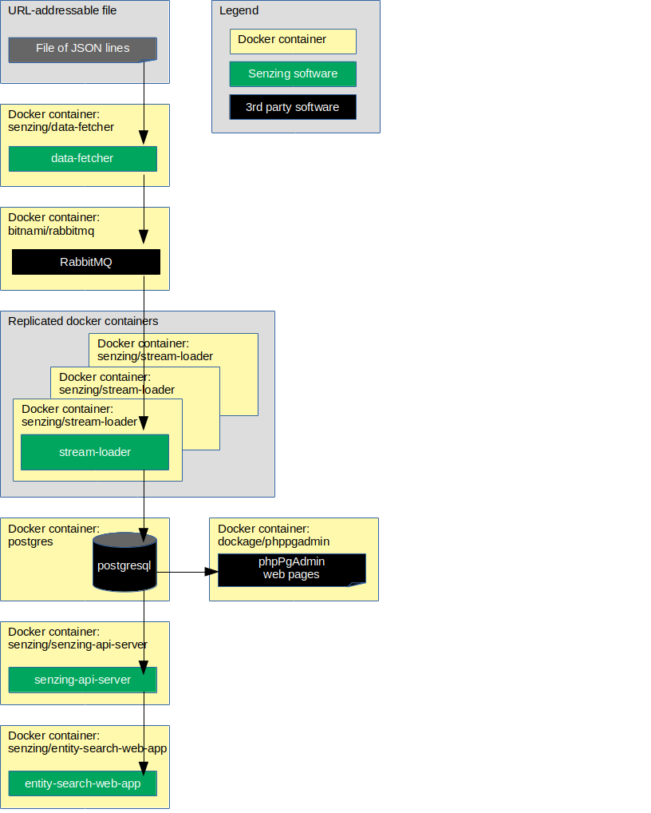

# docker-app-demo

## Overview

This repository illustrates a reference implementation of Senzing using
RabbitMQ as the queue and
PostgreSQL as the underlying database.

The instructions show how to set up a system that:

1. Reads JSON lines from a file on the internet.
1. Sends each JSON line to a message queue.
    1. In this implementation, the queue is RabbitMQ.
1. Reads messages from the queue and inserts into Senzing.
    1. In this implementation, Senzing keeps its data in a PostgreSQL database.
1. Reads information from Senzing via [Senzing REST API](https://github.com/Senzing/senzing-rest-api) server.
1. Views resolved entities in a [web app](https://github.com/Senzing/entity-search-web-app).

The following diagram shows the relationship of the docker containers in this docker composition.
Arrows represent data flow.



This docker formation brings up the following docker containers:

1. *[bitnami/rabbitmq](https://github.com/bitnami/bitnami-docker-rabbitmq)*
1. *[postgres](https://hub.docker.com/_/postgres)*
1. *[senzing/debug](https://github.com/Senzing/docker-senzing-debug)*
1. *[senzing/entity-web-search-app](https://github.com/Senzing/entity-search-web-app)*
1. *[senzing/init-container](https://github.com/Senzing/docker-init-container)*
1. *[senzing/jupyter](https://github.com/Senzing/docker-jupyter)*
1. *[senzing/mock-data-generator](https://github.com/Senzing/mock-data-generator)*
1. *[senzing/phppgadmin](https://hub.docker.com/r/senzing/phppgadmin)*
1. *[senzing/postgresql-client](https://github.com/Senzing/postgresql-client)*
1. *[senzing/redoer](https://github.com/Senzing/redoer)*
1. *[senzing/senzing-api-server](https://github.com/Senzing/senzing-api-server)*
1. *[senzing/stream-loader](https://github.com/Senzing/stream-loader)*

### Contents

1. [Expectations](#expectations)
    1. [Space](#space)
    1. [Time](#time)
    1. [Background knowledge](#background-knowledge)
1. [Preparation](#preparation)
    1. [Prerequisite software](#prerequisite-software)
1. [Using docker-app](#using-docker-app)
    1. [Set environment variables(]#set-environment-variables)
    1. [EULA](#eula)
    1. [Install Senzing](#install-senzing)
    1. [Run docker formation](#run-docker-formation)
1. [View data](#view-data)
    1. [View docker containers](#view-docker-containers)
    1. [View RabbitMQ](#view-rabbitmq)
    1. [View PostgreSQL](#view-postgresql)
    1. [View Senzing API](#view-senzing-api)
    1. [View Senzing Entity Search WebApp](#view-senzing-entity-search-webapp)
    1. [View Jupyter notebooks](#view-jupyter-notebooks)
1. [Cleanup](#cleanup)
1. [Development](#development)
1. [References](#references)

### Legend

1. :thinking: - A "thinker" icon means that a little extra thinking may be required.
   Perhaps you'll need to make some choices.
   Perhaps it's an optional step.
1. :pencil2: - A "pencil" icon means that the instructions may need modification before performing.
1. :warning: - A "warning" icon means that something tricky is happening, so pay attention.

## Expectations

### Space

This repository and demonstration require 7 GB free disk space.

### Time

Budget 1 hour to get the demonstration up-and-running, depending on CPU and network speeds.

### Background knowledge

This repository assumes a working knowledge of:

1. [Docker](https://github.com/Senzing/knowledge-base/blob/master/WHATIS/docker.md)

## Preparation

### Prerequisite software

The following software programs need to be installed:

1. [docker](https://github.com/Senzing/knowledge-base/blob/master/HOWTO/install-docker.md)
1. [docker-compose](https://github.com/Senzing/knowledge-base/blob/master/HOWTO/install-docker-compose.md)
1. [docker-app](https://github.com/Senzing/knowledge-base/blob/master/HOWTO/install-docker-app.md)

## Using docker-app

### Set environment variables

1. :thinking: Depending on how
   [docker app was installed](https://github.com/docker/app#installation),
   it may be invoked by either `docker app` or `docker-app`.
   Identify which invocation method is being used.

   **Option #1**  Docker App stand-alone.

    ```console
    export DOCKER_APP="docker-app"
    ```

   **Option #2**  Docker App CLI plugin.

    ```console
    export DOCKER_APP="docker app"
    ```

### EULA

To use the Senzing code, you must agree to the End User License Agreement (EULA).

1. :warning: This step is intentionally tricky and not simply copy/paste.
   This ensures that you make a conscious effort to accept the EULA.
   Example:

    <code>export SENZING_ACCEPT_EULA="&lt;the value from [this link](https://github.com/Senzing/knowledge-base/blob/master/lists/environment-variables.md#senzing_accept_eula)&gt;"</code>

### Install Senzing

The following installs the Senzing code and model data.

1. Run docker-app.
   Example:

    ```console
    ${DOCKER_APP} render \
      --set SENZING_ACCEPT_EULA=${SENZING_ACCEPT_EULA} \
      senzing/docker-app-senzing-install:0.3.0 \
      | docker-compose -f - up
    ```

1. **Note:** This may take a while to download.

### Run docker formation

The following brings up the docker formation seen in the
[Overview](#overview).

1. Run docker-app.
   Example:

    ```console
    ${DOCKER_APP} render \
      senzing/docker-app-senzing-demo:0.3.0 \
      | docker-compose -f - up
    ```

1. **Note:** Errors may be seen in the log until all dependent services are running.

## View data

### View docker containers

1. A good tool to monitor individual docker logs is
   [Portainer](https://github.com/Senzing/knowledge-base/blob/master/WHATIS/portainer.md).
   When running, Portainer is viewable at
   [localhost:9170](http://localhost:9170).

### View RabbitMQ

1. RabbitMQ is viewable at
   [localhost:15672](http://localhost:15672).
    1. **Defaults:** username: `user` password: `bitnami`
1. See
   [additional tips](https://github.com/Senzing/knowledge-base/blob/master/lists/docker-compose-demo-tips.md#rabbitmq)
   for working with RabbitMQ.

### View PostgreSQL

1. PostgreSQL is viewable at
   [localhost:9171](http://localhost:9171).
    1. **Defaults:** username: `postgres` password: `postgres`
1. See
   [additional tips](https://github.com/Senzing/knowledge-base/blob/master/lists/docker-compose-demo-tips.md#postgresql)
   for working with PostgreSQL.

### View Senzing API

View results from Senzing REST API server.
The server supports the
[Senzing REST API](https://github.com/Senzing/senzing-rest-api).

1. View REST API using [OpenApi "Swagger" editor](http://editor.swagger.io/?url=https://raw.githubusercontent.com/Senzing/senzing-rest-api/master/senzing-rest-api.yaml).
1. Example Senzing REST API request:
   [localhost:8250/heartbeat](http://localhost:8250/heartbeat)
1. See
   [additional tips](https://github.com/Senzing/knowledge-base/blob/master/lists/docker-compose-demo-tips.md#senzing-api-server)
   for working with Senzing API server.

### View Senzing Entity Search WebApp

1. Senzing Entity Search WebApp is viewable at
   [localhost:8251](http://localhost:8251).
1. See
   [additional tips](https://github.com/Senzing/knowledge-base/blob/master/lists/docker-compose-demo-tips.md#senzing-entity-search-webapp)
   for working with Senzing Entity Search WebApp.

### View Jupyter notebooks

1. Jupyter Notebooks are viewable at
   [localhost:9178](http://localhost:9178).
1. See
   [additional tips](https://github.com/Senzing/knowledge-base/blob/master/lists/docker-compose-demo-tips.md#jupyter-notebooks)
   for working with Jupyter Notebooks.

## Cleanup

1. Bring down docker formation.
   Example:

    ```console
    ${DOCKER_APP} render \
      senzing/docker-app-senzing-demo:0.3.0 \
      | docker-compose -f - down
    ```

    ```console
    ${DOCKER_APP} render \
      senzing/docker-app-senzing-install:0.3.0 \
      | docker-compose -f - down
    ```

## Development

The following steps are performed inside a local git repository directory for `docker-app-demo`.

1. Determine app version.

    1. Manually set version.
       Example:

        ```console
        export GIT_VERSION=0.3.0
        ```

    1. Pull version from Git repository.
       Example:

        ```console
        export GIT_VERSION=$(git describe --always --tags --long --dirty | sed -e 's/\-0//' -e 's/\-g.......//')
        ```

    1. Verify version:
       Example:

        ```console
        echo ${GIT_VERSION}
        ```

1. Push docker apps to DockerHub

    1. Push install app.
       Example:

        ```console
        ${DOCKER_APP} push \
          --tag senzing/docker-app-senzing-install:${GIT_VERSION} \
          senzing-install.dockerapp
        ```

    1. Push demo app.
       Example:

        ```console
        ${DOCKER_APP} push \
          --tag senzing/docker-app-senzing-demo:${GIT_VERSION} \
          senzing-demo.dockerapp
        ```

## Configuration

1. [JUPYTER_NOTEBOOKS_SHARED_DIR](https://github.com/Senzing/knowledge-base/blob/master/lists/environment-variables.md#jupyter_notebooks_shared_dir)
1. [POSTGRES_DIR](https://github.com/Senzing/knowledge-base/blob/master/lists/environment-variables.md#postgres_dir)
1. [RABBITMQ_DIR](https://github.com/Senzing/knowledge-base/blob/master/lists/environment-variables.md#rabbitmq_dir)
1. [SENZING_ACCEPT_EULA](https://github.com/Senzing/knowledge-base/blob/master/lists/environment-variables.md#senzing_accept_eula)
1. [SENZING_DATA_DIR](https://github.com/Senzing/knowledge-base/blob/master/lists/environment-variables.md#senzing_data_dir)
1. [SENZING_G2_DIR](https://github.com/Senzing/knowledge-base/blob/master/lists/environment-variables.md#senzing_g2_dir)
1. [SENZING_ETC_DIR](https://github.com/Senzing/knowledge-base/blob/master/lists/environment-variables.md#senzing_etc_dir)
1. [SENZING_VAR_DIR](https://github.com/Senzing/knowledge-base/blob/master/lists/environment-variables.md#senzing_var_dir)

## References

1. Docker app
    1. [GitHub](https://github.com/docker/app)
    1. [Working with Docker App](https://docs.docker.com/app/working-with-app/)
    1. [CLI documentation](https://docs.docker.com/engine/reference/commandline/app/)
1. Cloud Native Application Bundle
    1. [Web site](https://cnab.io/)
