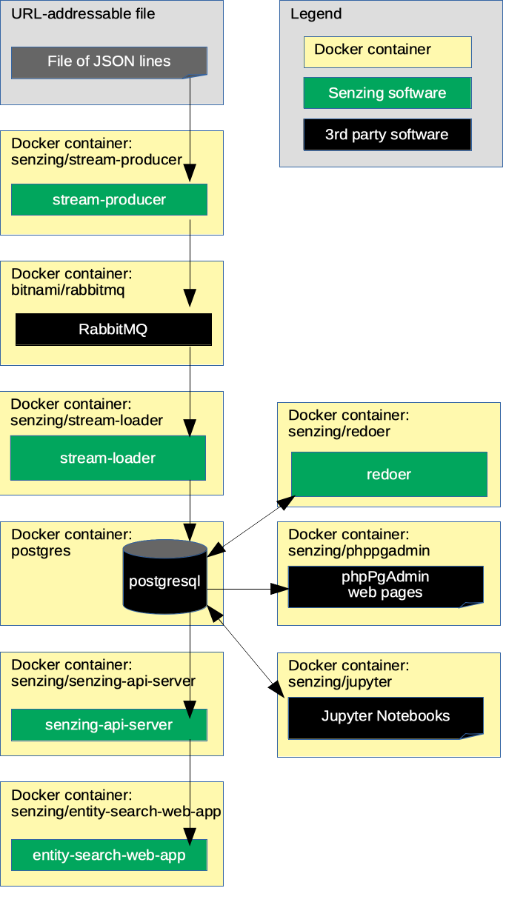

# docker-app-demo

## Overview

This repository illustrates a reference implementation of Senzing using
RabbitMQ as the queue and
PostgreSQL as the underlying database.

The instructions show how to set up a system that:

1. Reads JSON lines from a file on the internet.
1. Sends each JSON line to a message queue.
    1. In this implementation, the queue is RabbitMQ.
1. Reads messages from the queue and inserts into Senzing.
    1. In this implementation, Senzing keeps its data in a PostgreSQL database.
1. Reads information from Senzing via [Senzing REST API](https://github.com/Senzing/senzing-rest-api) server.
1. Views resolved entities in a [web app](https://github.com/Senzing/entity-search-web-app).

The following diagram shows the relationship of the docker containers in this docker composition.
Arrows represent data flow.



This docker formation brings up the following docker containers:

1. *[bitnami/rabbitmq](https://github.com/bitnami/bitnami-docker-rabbitmq)*
1. *[dockage/phppgadmin](https://hub.docker.com/r/dockage/phppgadmin)*
1. *[postgres](https://hub.docker.com/_/postgres)*
1. *[senzing/entity-web-search-app](https://github.com/Senzing/entity-search-web-app)*
1. *[senzing/mock-data-generator](https://github.com/Senzing/mock-data-generator)*
1. *[senzing/senzing-api-server](https://github.com/Senzing/senzing-api-server)*
1. *[senzing/stream-loader](https://github.com/Senzing/stream-loader)*

### Contents

1. [Expectations](#expectations)
    1. [Space](#space)
    1. [Time](#time)
    1. [Background knowledge](#background-knowledge)
1. [Preparation](#preparation)
    1. [Prerequisite software](#prerequisite-software)
    1. [Pull docker images](#pull-docker-images)
    1. [Create parameters file](#create-parameters-file)
1. [Using docker-app](#using-docker-app)
    1. [Set environment variables(]#set-environment-variables)
    1. [Install Senzing](#install-senzing)
    1. [Run docker formation](#run-docker-formation)
1. [View data](#view-data)
    1. [View RabbitMQ](#view-rabbitmq)
    1. [View PostgreSQL](#view-postgresql)
    1. [View Senzing API](#view-senzing-api)
    1. [View Senzing Entity Search WebApp](#view-senzing-entity-search-webapp)
1. [Cleanup](#cleanup)
1. [References](#references)

## Expectations

### Space

This repository and demonstration require 7 GB free disk space.

### Time

Budget 1 hour to get the demonstration up-and-running, depending on CPU and network speeds.

### Background knowledge

This repository assumes a working knowledge of:

1. [Docker](https://github.com/Senzing/knowledge-base/blob/master/WHATIS/docker.md)

## Preparation

### Prerequisite software

The following software programs need to be installed:

1. [docker](https://github.com/Senzing/knowledge-base/blob/master/HOWTO/install-docker.md)
1. [docker-app](https://github.com/Senzing/knowledge-base/blob/master/HOWTO/install-docker-app.md)

### Pull docker images

1. :thinking: **Optional:** To speed up later steps, docker images may be pulled in advance.
   Example:

    ```console
    sudo docker pull bitnami/minideb:stretch
    sudo docker pull bitnami/rabbitmq:3.7.16
    sudo docker pull jbergknoff/postgresql-client:latest
    sudo docker pull postgres:11.3
    sudo docker pull senzing/entity-search-web-app:1.0.2
    sudo docker pull senzing/init-container:1.3.0
    sudo docker pull senzing/mock-data-generator:1.1.0
    sudo docker pull senzing/phppgadmin:1.0.0
    sudo docker pull senzing/senzing-api-server:1.7.2
    sudo docker pull senzing/stream-loader:1.2.0
    sudo docker pull senzing/yum:1.1.0
    ```

### Create parameters file

The [docker app render](https://docs.docker.com/engine/reference/commandline/app_render)
command accepts a `--parameters-file` parameter which is
the location of a file of parameters tailored to a specific environment.
An example of a parameters file is [example.parameters](examples.parameters).

1. Default values can be seen in
   [senzing-demo.dockerapp/parameters.yml](senzing-demo.dockerapp/parameters.yml).

1. :pencil2: Create a parameters file, for example `/tmp/senzing-docker-app-demo.parameters`,
   having values that override default values.
   Examples:

    1. [POSTGRES_DIR](https://github.com/Senzing/knowledge-base/blob/master/lists/environment-variables.md#postgres_dir)
    1. [RABBITMQ_DIR](https://github.com/Senzing/knowledge-base/blob/master/lists/environment-variables.md#rabbitmq_dir)
    1. [SENZING_ACCEPT_EULA](https://github.com/Senzing/knowledge-base/blob/master/lists/environment-variables.md#senzing_accept_eula)
    1. [SENZING_DATA_DIR](https://github.com/Senzing/knowledge-base/blob/master/lists/environment-variables.md#senzing_data_dir)
    1. [SENZING_G2_DIR](https://github.com/Senzing/knowledge-base/blob/master/lists/environment-variables.md#senzing_g2_dir)
    1. [SENZING_ETC_DIR](https://github.com/Senzing/knowledge-base/blob/master/lists/environment-variables.md#senzing_etc_dir)
    1. [SENZING_VAR_DIR](https://github.com/Senzing/knowledge-base/blob/master/lists/environment-variables.md#senzing_var_dir)

## Using docker-app

### Set environment variables

1. :thinking: Depending on how
   [docker app was installed](https://github.com/docker/app#installation),
   it may be invoked by either `docker app` or `docker-app`.
   Identify which invocation method is being used.

   **Example #1**  Docker App stand-alone.

    ```console
    export DOCKER_APP="docker-app"
    ```

   **Example #2**  Docker App CLI plugin.

    ```console
    export DOCKER_APP="docker app"
    ```

1. :pencil2: Identify parameters file location.
   Example:

    ```console
    export DOCKER_APP_PARAMETERS_FILE="/tmp/senzing-docker-app-demo.parameters"
    ```

### Install Senzing

The following installs the Senzing code and model data.

1. Run docker-app.
   Example:

    ```console
    ${DOCKER_APP} render \
      --parameters-file "${DOCKER_APP_PARAMETERS_FILE}" \
      senzing/docker-app-senzing-install \
      | docker-compose -f - up
    ```

### Run docker formation

The following brings up the docker formation seen in the
[Overview](#overview).

1. Run docker-app.
   Example:

    ```console
    ${DOCKER_APP} render \
      --parameters-file "${DOCKER_APP_PARAMETERS_FILE}" \
      senzing/docker-app-senzing-demo \
      | docker-compose -f - up
    ```

## View data

1. Username and password for the following sites were either passed in as environment variables
   or are the default values seen in
   [docker-compose-rabbitmq-postgresql.yaml](../../resources/postgresql/docker-compose-rabbitmq-postgresql.yaml).

### View docker containers

1. A good tool to monitor individual docker logs is
   [Portainer](https://github.com/Senzing/knowledge-base/blob/master/WHATIS/portainer.md).
   When running, Portainer is viewable at
   [localhost:9170](http://localhost:9170).

### View RabbitMQ

1. RabbitMQ is viewable at
   [localhost:15672](http://localhost:15672).
    1. **Defaults:** username: `user` password: `bitnami`

### View PostgreSQL

1. PostgreSQL is viewable at
   [localhost:9171](http://localhost:9171).
    1. **Defaults:** username: `postgres` password: `postgres`
1. On left-hand navigation, select "G2" database to explore.
1. The records received from the queue can be viewed in the following Senzing tables:
    1. G2 > DSRC_RECORD
    1. G2 > OBS_ENT

### View Senzing API

1. View results from Senzing REST API server.
   The server supports the
   [Senzing REST API](https://github.com/Senzing/senzing-rest-api).

   1. From a web browser.
      Examples:
      1. [localhost:8250/heartbeat](http://localhost:8250/heartbeat)
      1. [localhost:8250/license](http://localhost:8250/license)
      1. [localhost:8250/entities/1](http://localhost:8250/entities/1)
   1. From `curl`.
      Examples:

        ```console
        export SENZING_API_SERVICE=http://localhost:8250

        curl -X GET ${SENZING_API_SERVICE}/heartbeat
        curl -X GET ${SENZING_API_SERVICE}/license
        curl -X GET ${SENZING_API_SERVICE}/entities/1
        ```

   1. From [OpenApi "Swagger" editor](http://editor.swagger.io/?url=https://raw.githubusercontent.com/Senzing/senzing-rest-api/issue-33.dockter.1/senzing-rest-api.yaml).

### View Senzing Entity Search WebApp

1. Senzing Entity Search WebApp is viewable at
   [localhost:8251](http://localhost:8251).

1. The [demonstration](https://github.com/Senzing/knowledge-base/blob/master/demonstrations/docker-compose-web-app.md)
   instructions will give a tour of the Senzing web app.

## Cleanup

1. Bring down docker formation.
   Example:

    ```console
    ${DOCKER_APP} render \
      --parameters-file "${DOCKER_APP_PARAMETERS_FILE}" \
      senzing/docker-app-senzing-demo \
      | docker-compose -f - down
    ```

    ```console
    ${DOCKER_APP} render \
      --parameters-file "${DOCKER_APP_PARAMETERS_FILE}" \
      senzing/docker-app-senzing-install \
      | docker-compose -f - down
    ```

## References

1. Docker app
    1. [GitHub](https://github.com/docker/app)
    1. [Working with Docker App](https://docs.docker.com/app/working-with-app/)
    1. [CLI documentation](https://docs.docker.com/engine/reference/commandline/app/)
1. Cloud Native Application Bundle
    1. [Web site](https://cnab.io/)
